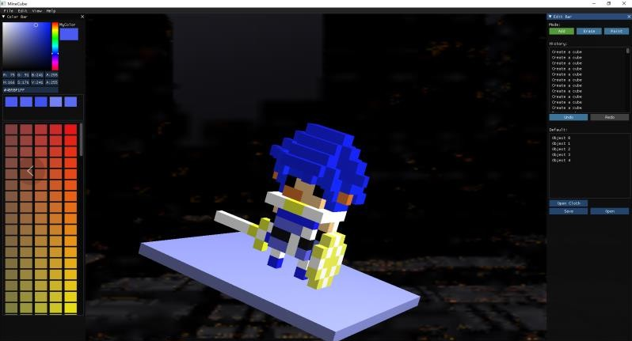

# MineCube

**A sample voxel editor based on OpenGL 3.3+**, inspired by [MagicaVoxel](https://ephtracy.github.io/).

Support Windows 10 and Mac OX currently.

A final project originally of 5 undergraduate students for the course Computer Graphics, SYSU.

**A good OpenGL learning example** for the green hand in Computer Graphics, while maybe not the best practice in the related field.

## Create any small stuff you like!


## More Image Example





## Iteration Details (Chinese)

[迭代计划](./docs/迭代计划.md)

We mainly use issue && project to manage development in the futrue. The document above won't be updated.

## Dependences

1. OpenGL 3.3+
2. [GLAD](https://github.com/Dav1dde/glad)


> From [LearnOpenGL](https://learnopengl.com/Getting-started/Creating-a-window):
>
> Go to the [web service](http://glad.dav1d.de/), make sure the language is set to C++ and in the API section, select an OpenGL version of at least 3.3 (which is what we'll be using for this repo; higher versions may be fine as well). Also make sure the profile is set to *Core* and that the *Generate a loader* option is ticked. Ignore the extensions (for now) and click *Generate* to produce the resulting library files.

> Chinese Version: 打开GLAD的[在线服务](http://glad.dav1d.de/)，将语言(Language)设置为**C/C++**，在API选项中，选择**3.3**以上的OpenGL(gl)版本（本仓库中将使用3.3版本，但更新的版本应该也能正常工作）。之后将模式(Profile)设置为**Core**，并且保证**生成加载器**(Generate a loader)的选项是选中的。现在可以先（暂时）忽略拓展(Extensions)中的内容。都选择完之后，点击**生成**(Generate)按钮来生成库文件。

3. ~~GLFW Master 3.2.1~~ [GLFW Master branch](https://github.com/glfw/glfw)
4. [GLM 0.9.8.5](https://github.com/g-truc/glm/releases/tag/0.9.8.5)
5. [imgui v1.60](https://github.com/ocornut/imgui/releases/tag/v1.60)
6. [nlohmann::json v3.1.2](https://github.com/nlohmann/json/releases/tag/v3.1.2) , 只需要下载 `json.hpp` 的 release 文件。
7. [freetype 2.9.1](https://download.savannah.gnu.org/releases/freetype/) , 建议下载 `ft291.zip` 并解压 , 然后将 freetype-2.9.1 文件夹更名为 freetype 添加至 `3rd_party` 。

## How to Run Demo 

### 1. Download the Binary File in Release

[Release List](https://github.com/longjj/MineCube/releases)

### 2. Build from the Source

1. Create a new directory  `3rd_party` at root.
2. Download and unzip `glad`, `glfw`, `glm`, `imgui` dependences  following the URL above. 
3. Rename all the dependences' directories without certain version number.
4. Download `nlohmann/json.hpp` file from the URL above.

Now your `3rd_party` looks like:

```
3rd_party/
----glad/
----glfw/
----glm/
----imgui/
----nlohmann/json.hpp
----freetype
```

5. Use Cmake to generate your project file.

#### 2.1 Windows (Visual Studio 2015 or higher)

1. Use Cmake-gui to generate the `build/` dir.
2. Open it in Visual Studio, set `MineCube` as Startup Project.
3. Compile it and run the program.

> You might need to modify the shaders' path in `demo.cpp`

#### 2.2 Mac OS

1. Generate the `build/` dir and enter it

   ```Shell
   mkdir build
   cd build
   ```

2. If you want to do you work on Xcode, do the following

   ```shell
    cmake -G "Xcode" ..
   ```

   If something goes wrong, such as :

   ```
   CMake Error: Error required internal CMake variable not set, cmake may not be built correctly.
   Missing variable is:
   CMAKE_C_COMPILE_OBJECT
   ```

   Then you may need to add following statement to the `CMakeLists.txt` in the end of the file:

   ```
   set(CMAKE_C_COMPILE_OBJECT g++)
   ```

3. Then, you will find `MineCube.xcodeproj` . You can eithor double click to open it or just `open MineCube.xcodeproj`


## Contributors

- [Johnny Law](https://longjj.com/)
- [Bob Wu](https://github.com/Bowenwu1)
- [Jarvis](https://github.com/Ace-0)
- [Mr.Gu 菇生](https://github.com/mgsweet)
- [Hiyoung.Tsui](https://github.com/15331335)

## Bugs Report

Feel free to new issues. 
